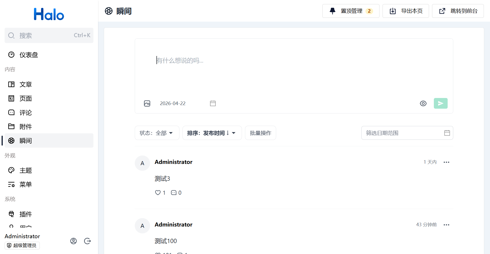

# plugin-moments-pro

> **Halo 瞬间插件增强版（Enhanced Moments Plugin for [Halo](https://halo.run)）**
>
> 基于官方 [halo-sigs/plugin-moments](https://github.com/halo-sigs/plugin-moments) 二次开发，面向高频使用者与独立博客主，在原版「轻量图文动态」之上带来更顺手的后台编辑、更强的列表操控与更友好的发布时间管理。

如果这个项目对你有帮助，欢迎点一个 **⭐ Star**，这是对作者持续维护的最大鼓励！

---

## ✨ 相较官方版的增强点

| 能力 | 官方版 | `plugin-moments-pro` |
| --- | --- | --- |
| 发布日期 | 只能由系统在创建时自动写入，事后无法修改 | ✅ 新建/编辑均可自定义「发布日期」，补录历史动态不再别扭 |
| 日期快捷选择 | ❌ | ✅ 内置「今天 / 昨天 / 明天 / 上周此刻」快捷项 |
| 置顶功能 | ❌ | ✅ 独立「置顶管理」弹窗：一键置顶、上移/下移/置顶/置底、取消置顶；前后台均按顺序展示置顶项 |
| 点赞数手动修改 | 只能通过前台用户点赞累加，后台无法修改 | ✅ 后台编辑瞬间时可直接把 upvote 改成任意整数（走 Halo Counter API） |
| 批量操作 | ❌ | ✅ 列表顶部可开启「批量操作」模式，支持批量删除、批量审核、批量改可见性 |
| 导出能力 | ❌ | ✅ 右上角"导出本页"一键导出当前列表为 JSON，便于备份/迁移/外部分析 |
| 列表默认排序 | 固定按 `metadata.creationTimestamp` | ✅ 置顶优先，其余按 `spec.releaseTime` 降序；支持 UI 一键切换排序方式 |
| 列表排序选项 | ❌ | ✅ 支持「发布时间 / 创建时间 × 升降序」切换，URL 可分享 |
| 用户中心（UC）过滤 | 仅按标签与时间 | ✅ 追加「可见性」「排序」筛选 |
| 保存按钮 | 灰色禁用、无提示 | ✅ 悬浮气泡明确告知禁用原因（内容为空 / 未修改 / 附件超限） |
| `Ctrl+Enter` 提交 | 偶发不响应 | ✅ 基于 tiptap `editorProps.handleKeyDown` 注册，稳定触发；`⌘+Enter` 同样支持 |
| 编辑时 patch 字段 | 不包含 `releaseTime` | ✅ 编辑时把 `releaseTime` 一并下发，改日期即可"补发"动态 |
| 列表 UI/UX | 简单列表 | ✅ 过滤区粘性顶部、空状态插图、置顶抽成独立弹窗管理、批量模式高亮、加载过程不遮盖旧数据 |

> 还有更多改进持续加入中，见 [更新日志](#-更新日志) 或关注本仓库。



---

## 🎯 适用场景

- **独立博客 / 个人站**：把碎碎念、读书随笔、探店打卡做成类微博的时间线
- **团队小社区**：记录项目进展、产品日志、发版动态
- **数字花园 / Digital Garden**：补录历史内容时能自由指定"发布时间"，保持时间线连贯
- **自托管替代方案**：不想把内容发在微博/Twitter/即刻上，又想拥有同款"瞬间"体验

插件能力一览：

1. 富文本编辑器，支持图文、视频、音频、标签（`#话题`）、代码高亮（配合 Shiki 插件）
2. 公开 / 私有可见性控制，支持后台先审后发
3. 前台 `/moments` 路由 + 详情页 + RSS 订阅（`/moments/rss.xml`）
4. 接入 Halo 全站搜索（type：`moment.moment.halo.run`）
5. 用户中心（UC）支持普通用户自行发布、管理自己的瞬间
6. 评论通知、Reconciler 异步处理、Finder API，适合主题开发者二次集成

---

## 🚀 使用方式

1. 下载插件 JAR，方式二选一：
    - **GitHub Releases**：本仓库 [Releases](https://github.com/DoublePeach/plugin-moments-pro/releases) 页面下载最新 `plugin-moments-x.x.x.jar`
    - （可选）Halo 应用市场官方版：<https://halo.run/store/apps/app-SnwWD>（非本增强版）
2. 在 Halo 后台「插件」页面上传安装，插件管理详见：<https://docs.halo.run/user-guide/plugins>
3. 启用后，左侧菜单会出现 **瞬间**，点击即可管理
4. 前台访问地址 `/moments`，需主题提供 `moments.html` 模板
5. RSS 订阅地址 `/moments/rss.xml`
6. 数据会同步至 Halo 搜索，类型为 `moment.moment.halo.run`

---

## 🛠 开发环境

插件开发详细文档：<https://docs.halo.run/developer-guide/plugin/introduction>

所需环境：

1. Java 17
2. Node 18
3. pnpm 8
4. Docker（可选，推荐）

克隆项目：

```bash
git clone https://github.com/DoublePeach/plugin-moments-pro.git
cd plugin-moments-pro
```

### 运行方式 1（推荐，依赖 Docker）

```bash
# macOS / Linux
./gradlew pnpmInstall
./gradlew haloServer

# Windows
./gradlew.bat pnpmInstall
./gradlew.bat haloServer
```

执行后会自动拉起一个 Halo 的 Docker 容器并加载当前插件，文档参考：<https://docs.halo.run/developer-guide/plugin/basics/devtools>

### 运行方式 2（源码运行 Halo）

```bash
# macOS / Linux
./gradlew build

# Windows
./gradlew.bat build
```

在 Halo 配置中启用本地插件路径：

```yaml
halo:
    plugin:
        runtime-mode: development
        fixedPluginPath:
            - "/path/to/plugin-moments-pro"
```

然后重启 Halo 即可。

---

## 📝 更新日志

### Pro 版本增量（基于官方 `main`）

- **列表与编辑体验**
  - 新建/编辑 瞬间时支持选择「发布日期」（精确到日）
  - 日期选择器内置快捷项：今天 / 昨天 / 明天 / 上周此刻
  - 列表支持排序下拉（发布时间 / 创建时间 × 升降序），URL 可分享
  - 列表默认按置顶优先 + `spec.releaseTime` 降序展示
  - 保存按钮在禁用时显示原因气泡
  - `Ctrl+Enter` / `⌘+Enter` 通过 tiptap keymap 注册，稳定触发提交
  - 列表过滤栏改为粘性顶部，空状态新增插图+引导文案
  - 加载过程中旧数据以半透明形式保留，减少闪烁
- **管理能力**
  - 新增「置顶管理」弹窗：主列表默认不再显示置顶瞬间，避免重复与噪音
    - 顶部按钮带数量徽标，点击打开独立弹窗
    - 支持上移/下移/置顶/置底/取消置顶，保存时一次性提交新顺序
    - 前台 `/moments` 也会按置顶顺序展示置顶项，再接非置顶项
  - 编辑瞬间时新增「点赞数」手动编辑：走 Halo Counter API，可直接把任意整数写入 `upvote` 字段
  - 列表顶部新增「批量操作」模式：可多选后批量删除、批量审核、批量设为公开/私有
  - 顶部操作区新增"导出本页"，一键导出当前筛选条件下的 JSON 数据
  - 主列表过滤区移除"标签"（标签由正文自动提取，该筛选少被使用）
- **UC（用户中心）**
  - 补齐「可见性」「排序」筛选条件
  - 编辑自己的瞬间时同样支持修改发布日期

### 新增的 Console API

以下接口仅在登录态的后台（`console` 分组）中可用：

| Method | Path | 描述 |
| --- | --- | --- |
| `PUT` | `/apis/console.api.moment.halo.run/v1alpha1/moments/{name}/pin` | 置顶指定瞬间 |
| `PUT` | `/apis/console.api.moment.halo.run/v1alpha1/moments/{name}/unpin` | 取消置顶 |
| `PUT` | `/apis/console.api.moment.halo.run/v1alpha1/moments/-/pin-order` | 批量调整置顶顺序，body 为 `{ "names": ["..."] }` |
| `POST` | `/apis/console.api.moment.halo.run/v1alpha1/moments/-/delete-batch` | 批量删除，body 为 `{ "names": ["..."] }` |
| `POST` | `/apis/console.api.moment.halo.run/v1alpha1/moments/-/approve-batch` | 批量审核通过，body 为 `{ "names": ["..."] }` |
| `POST` | `/apis/console.api.moment.halo.run/v1alpha1/moments/-/visible-batch` | 批量改可见性，body 为 `{ "names": ["..."], "visible": "PUBLIC"\|"PRIVATE" }` |

此外，`ListMoments` 接口新增了一个可选查询参数 `pinned`：

- `pinned=true`：只返回已置顶的瞬间
- `pinned=false`：只返回未置顶的瞬间（供主列表排除置顶项使用）
- 省略：返回全部

点赞数的修改复用 Halo 核心 `Counter` 接口：

- `GET /apis/metrics.halo.run/v1alpha1/counters/moments.moment.halo.run/{momentName}`
- `PUT /apis/metrics.halo.run/v1alpha1/counters/moments.moment.halo.run/{momentName}`（写入整条 Counter 对象）

### 数据模型新增字段

为 `MomentSpec` 新增了两个可选字段，均兼容历史数据（默认 `null`）：

- `pinned: boolean` - 是否置顶
- `pinOrder: integer` - 置顶位次，数值越大越靠前；取消置顶时自动清空

---

## 📡 公开 API

### 查询瞬间列表

`/apis/api.moment.halo.run/v1alpha1/moments`

**参数**：

1. `page: int` - 分页页码，从 1 开始
2. `size: int` - 分页条数
3. `tag: string` - 标签
4. `ownerName: string` - 创建者用户名 name
5. `startDate: string` - 开始时间，通过时间区间筛选发布时间
6. `endDate: string` - 结束时间
7. `sort: string[]` - 排序字段，格式为 `字段名,排序方式`，如 `spec.releaseTime,desc`

**返回值类型**：[ListResult\<MomentVo\>](#listresultmomentvo)

### 查询瞬间详情

`/apis/api.moment.halo.run/v1alpha1/moments/{name}`

**参数**：

1. `name: string` - 瞬间的唯一标识 name

**返回值类型**：[MomentVo](#momentvo)

---

## 🎨 主题适配

目前此插件为主题端提供了 `/moments` 路由，模板为 `moments.html`，也提供了 [Finder API](https://docs.halo.run/developer-guide/theme/finder-apis)，可以将瞬间列表渲染到任何地方。

### 模板变量

#### 列表页面 `/moments`

- 模板路径：`/templates/moments.html`
- 访问路径：`/moments?tag={tag}` | `moments/page/{page}?tag={tag}`

**参数**：

- `tag`：标签名称，用于筛选

**变量**：

- `moments`：[UrlContextListResult\<MomentVo\>](#urlcontextlistresultmomentvo)
- `tags`：[List\<MomentTagVo\>](#momenttagvo)

**示例**：

```html
<!-- 渲染标签列表 -->
<ul>
    <li th:each="tag : ${tags}">
        <a
            th:href="|/moments?tag=${tag.name}|"
            th:classappend="${#lists.contains(param.tag, tag.name) ? 'active' : ''}"
        >
            <span th:text="${tag.name}"></span>
            <span th:text="${tag.momentCount}"></span>
        </a>
    </li>
</ul>

<div>
    <!-- 渲染瞬间列表 -->
    <ul>
        <li th:each="moment : ${moments.items}" th:with="content=${moment.spec.content}">
            <div th:if="${not #strings.isEmpty(content.html)}" th:utext="${content.html}"></div>
            <th:block th:if="${not #lists.isEmpty(content.medium)}" th:each="momentItem : ${content.medium}">
                
                <video th:if="${momentItem.type.name == 'VIDEO'}" th:src="${momentItem.url}"></video>
                <audio th:if="${momentItem.type.name == 'AUDIO'}" th:src="${momentItem.url}" controls="true"></audio>
            </th:block>
        </li>
    </ul>
    <div th:if="${moments.hasPrevious() || moments.hasNext()}">
        <a th:href="@{${moments.prevUrl}}">
            <span>上一页</span>
        </a>
        <span th:text="${moments.page}"></span>
        <a th:href="@{${moments.nextUrl}}">
            <span>下一页</span>
        </a>
    </div>
</div>
```

#### 详情页面 `/moments/{name}`

- 模板路径：`/templates/moment.html`
- 访问路径：`/moments/{name}`

**变量**：

- `moment`：[MomentVo](#momentvo)

**示例**：

```html
<div>
    <div th:with="content=${moment.spec.content}">
        <div th:if="${not #strings.isEmpty(content.html)}" th:utext="${content.html}"></div>
        <th:block th:if="${not #lists.isEmpty(content.medium)}" th:each="momentItem : ${content.medium}">
            
            <video th:if="${momentItem.type.name == 'VIDEO'}" th:src="${momentItem.url}"></video>
            <audio th:if="${momentItem.type.name == 'AUDIO'}" th:src="${momentItem.url}" controls="true"></audio>
        </th:block>
    </div>
</div>
```

#### 搜索路由

**变量**：

- `type: moment.moment.halo.run`

### Finder API

#### `listAll()`

获取全部瞬间内容。

**返回值类型**：`List<`[MomentVo](#momentvo)`>`

**示例**：

```html
<ul>
    <li th:each="moment : ${momentFinder.listAll()}" th:with="content = ${moment.spec.content}">
        <div th:if="${not #strings.isEmpty(content.html)}" th:utext="${content.html}"></div>
        <th:block th:if="${not #lists.isEmpty(content.medium)}" th:each="momentItem : ${content.medium}">
            
            <video th:if="${momentItem.type.name == 'VIDEO'}" th:src="${momentItem.url}"></video>
            <audio th:if="${momentItem.type.name == 'AUDIO'}" th:src="${momentItem.url}" controls="true"></audio>
        </th:block>
    </li>
</ul>
```

#### `list({...})`

```html
momentFinder.list({
  page: 1,
  size: 10,
  tagName: 'fake-tag',
  owner: 'fake-owner',
  sort: {'spec.releaseTime,desc', 'metadata.creationTimestamp,asc'}
})
```

统一参数的瞬间列表查询方法，支持分页、标签、创建者、排序等参数，且均为可选参数。

**参数**：

1. `page: int` - 分页页码，从 1 开始
2. `size: int` - 分页条数
3. `tagName: string` - 标签
4. `owner: string` - 创建者用户名 name
5. `sort: string[]` - 排序字段，格式为 `字段名,排序方式`，传递时需要使用 `{}` 形式并用逗号分隔表示数组

**返回值类型**：[ListResult\<MomentVo\>](#listresultmomentvo)

**示例**：

```html
<th:block th:with="moments = ${momentFinder.list({
  page: 1,
  size: 10,
  tagName: 'fake-tag',
  owner: 'fake-owner',
  sort: {'spec.releaseTime,desc', 'metadata.creationTimestamp,asc'}
})}">
    <ul>
        <li th:each="moment : ${moments.items}" th:with="content = ${moment.spec.content}">
            <div th:if="${not #strings.isEmpty(content.html)}" th:utext="${content.html}"></div>
            <th:block th:if="${not #lists.isEmpty(content.medium)}" th:each="momentItem : ${content.medium}">
                
                <video th:if="${momentItem.type.name == 'VIDEO'}" th:src="${momentItem.url}"></video>
                <audio th:if="${momentItem.type.name == 'AUDIO'}" th:src="${momentItem.url}" controls="true"></audio>
            </th:block>
        </li>
    </ul>
    <div>
        <span th:text="${moments.page}"></span>
    </div>
</th:block>
```

#### `list(page, size)`

根据分页参数获取瞬间列表。

**参数**：

1. `page: int` - 分页页码，从 1 开始
2. `size: int` - 分页条数

**返回值类型**：[ListResult\<MomentVo\>](#listresultmomentvo)

**示例**：

```html
<th:block th:with="moments = ${momentFinder.list(1, 10)}">
    <ul>
        <li th:each="moment : ${moments.items}" th:with="content = ${moment.spec.content}">
            <div th:if="${not #strings.isEmpty(content.html)}" th:utext="${content.html}"></div>
            <th:block th:if="${not #lists.isEmpty(content.medium)}" th:each="momentItem : ${content.medium}">
                
                <video th:if="${momentItem.type.name == 'VIDEO'}" th:src="${momentItem.url}"></video>
                <audio th:if="${momentItem.type.name == 'AUDIO'}" th:src="${momentItem.url}" controls="true"></audio>
            </th:block>
        </li>
    </ul>
    <div>
        <span th:text="${moments.page}"></span>
    </div>
</th:block>
```

### 类型定义

#### MomentVo

```json
{
    "metadata": {
        "name": "string",
        "labels": {
            "additionalProp1": "string"
        },
        "annotations": {
            "additionalProp1": "string"
        },
        "creationTimestamp": "2022-11-20T13:06:38.512Z"
    },
    "spec": {
        "content": {
            "raw": "string",
            "html": "string",
            "medium": [
                {
                    "type": "#MomentMediaType",
                    "url": "string",
                    "originType": "string"
                }
            ]
        },
        "releaseTime": "string",
        "visible": "PUBLIC",
        "owner": "string",
        "tags": ["string"],
        "pinned": false,
        "pinOrder": 0
    },
    "owner": {
        "name": "string",
        "avatar": "string",
        "bio": "string",
        "displayName": "string"
    },
    "stats": {
        "upvote": 0,
        "totalComment": 0,
        "approvedComment": 0
    }
}
```

#### MomentMediaType

```java
enum Target {
  PHOTO,   // 图片
  VIDEO,   // 视频
  POST,    // 文章
  AUDIO;   // 音频
}
```

#### ListResult&lt;MomentVo&gt;

```json
{
    "page": 0,
    "size": 0,
    "total": 0,
    "items": "List<#MomentVo>",
    "first": true,
    "last": true,
    "hasNext": true,
    "hasPrevious": true,
    "totalPages": 0
}
```

#### UrlContextListResult&lt;MomentVo&gt;

```json
{
    "page": 0,
    "size": 0,
    "total": 0,
    "items": "List<#MomentVo>",
    "first": true,
    "last": true,
    "hasNext": true,
    "hasPrevious": true,
    "totalPages": 0,
    "prevUrl": "string",
    "nextUrl": "string"
}
```

#### MomentTagVo

```json
{
    "name": "string",
    "permalink": "string",
    "momentCount": 0
}
```

---

## 🤝 参与贡献

欢迎通过 Issue 和 Pull Request 参与共建：

- 上游仓库（官方原版）：<https://github.com/halo-sigs/plugin-moments>
- 本增强版：<https://github.com/DoublePeach/plugin-moments-pro>

提 Issue 前请先确认是否在官方原版也存在；如果是本项目新增能力相关，请带上复现步骤与环境信息，非常感谢！

## 📄 License

沿用上游项目的 [GPL-3.0 License](./LICENSE)。
